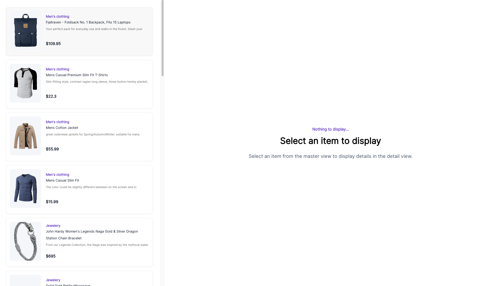
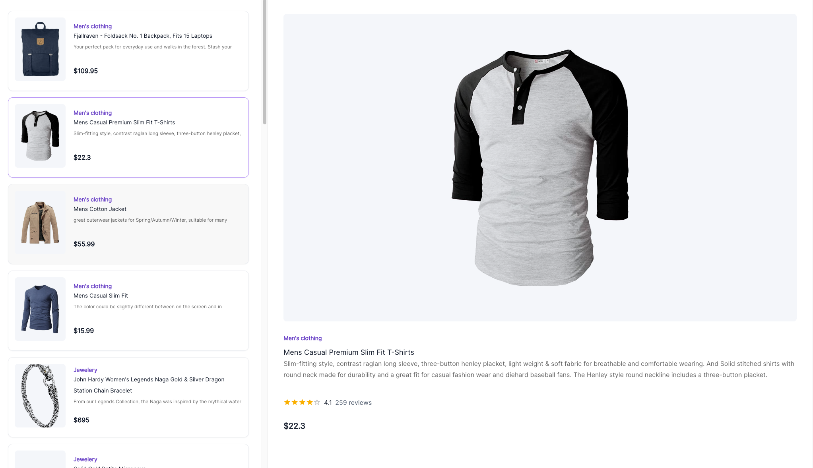
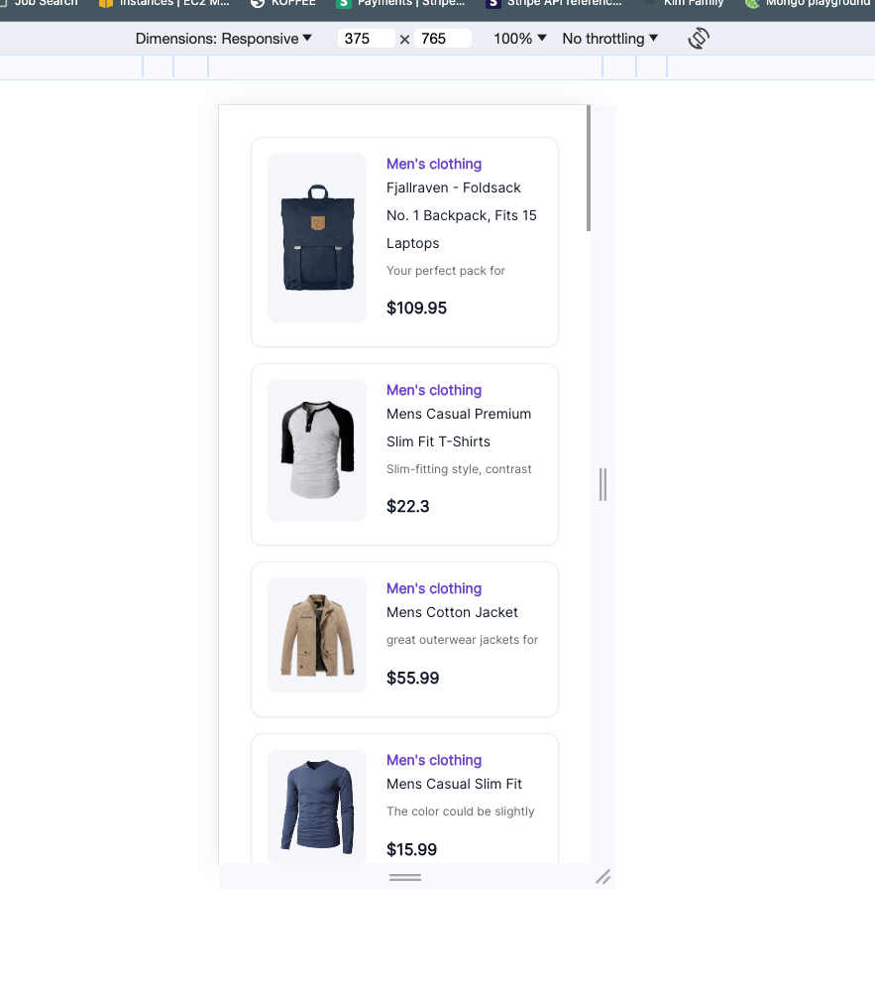
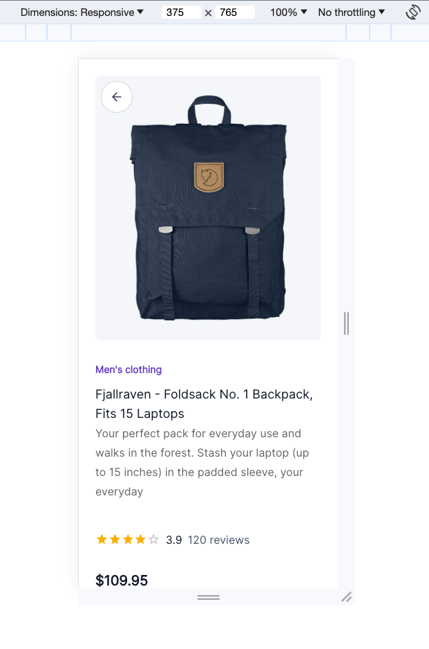

# React Project
Completed by Hyo Kim

This project was bootstrapped with [Create React App](https://github.com/facebook/create-react-app). Using the Figma link provided, a mock up has been created.

A couple enhancements were made:
1. using react-query to manager server state
2. some animations (hovering on card, loading icon when data is being fetched, etc)

Please see video recording [here](https://www.loom.com/share/1bba0b58c1d5445e8793265832b021f4?sid=d4ce13e8-554b-40c7-9141-c68f64624b9f)

## Available Scripts

In the project directory, you can run:

### `npm start`

Runs the app in the development mode.\
Open [http://localhost:3000](http://localhost:3000) to view it in the browser.

The page will reload if you make edits.\
You will also see any lint errors in the console.
